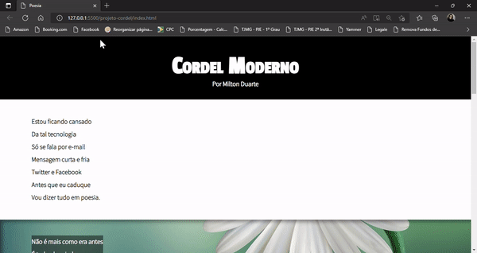
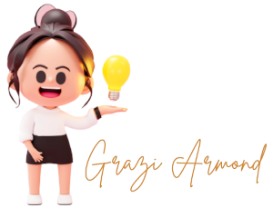

## Projeto.
### Finalizado em 22/07/2022
#

Neste projeto eu utilizei somente o HTML e CSS.  
O resultado:

<figure>
    
</figure>

### Conhecimentos adquiridos:
- background-image (linear-gradient e Url)
- background-color
- background-size
- background-position
- background-repeat
- background-attachment
- Shorthand - background
- root
- responsividade

#### Para criar o ReadMe, eu utilizei o [Guia completo para aprender Markdown](https://www.markdownguide.org/basic-syntax/) 

<figure>
    
</figure>

